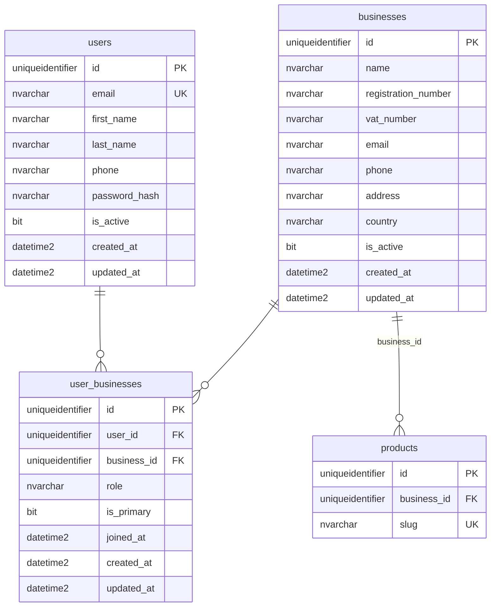

# Businesses and multi-tenant catalogue (Path A)

This project uses **Path A (additive)**: new tables model **merchants / staff membership**; the existing storefront catalogue remains **`dbo.products` + `dbo.product_variants` + `dbo.inventory_quantity`**. There is **no** separate flat `business_products` table.

## Chosen integration (Path A)

- **`dbo.businesses`**: legal/ops entity (name, registration, VAT, contact, address).
- **`dbo.user_businesses`**: many-to-many between **`dbo.users`** and **`dbo.businesses`**, with `role` (business-scoped) and `is_primary` (at most one primary membership per user via filtered unique index).
- **`dbo.products.business_id`**: nullable FK to **`dbo.businesses`**. Legacy or global rows may be `NULL` until backfilled or assigned. New code may pass `businessId` into [`createProductSimple`](../backend/src/repos/productsRepo.ts).
- **Diagram `PRODUCTS`**: represented by the **existing** product + variant model, scoped with **`business_id`** on the product row—not a second product table.

Path B (replace with flat SKU table) and Path C (greenfield only) are **not** implemented.

## Entity diagram (implemented)



## Foreign keys and indexes

| Object | Notes |
|--------|--------|
| `FK_user_businesses_user` | `user_businesses.user_id` → `users.id` ON DELETE CASCADE |
| `FK_user_businesses_business` | `user_businesses.business_id` → `businesses.id` ON DELETE CASCADE |
| `UQ_user_businesses_user_business` | UNIQUE `(user_id, business_id)` |
| `UQ_user_businesses_one_primary` | UNIQUE `(user_id)` WHERE `is_primary = 1` |
| `UQ_businesses_registration_number` | UNIQUE `(registration_number)` WHERE `registration_number IS NOT NULL` |
| `FK_products_business` | `products.business_id` → `businesses.id` (nullable column) |

### Merchant PK migration (022)

[`backend/migrations/022_businesses_merchant_pk.sql`](../backend/migrations/022_businesses_merchant_pk.sql) can replace the legacy shape above: **`dbo.businesses`** primary key becomes **`pay_today_merchant_id` (INT)**; **`dbo.user_businesses`** temporarily links via **`pay_today_merchant_id`**; **`dbo.products`** uses **`pay_today_merchant_id`** instead of **`business_id`**. Foreign key names may be reused (`FK_user_businesses_business`, `FK_products_business`) but target the INT key.

[`backend/migrations/028_user_businesses_stable_business_id.sql`](../backend/migrations/028_user_businesses_stable_business_id.sql) then adds a **stable `business_id` (UNIQUEIDENTIFIER)** on **`dbo.businesses`** (unique alternate key, default for new rows) and moves **`dbo.user_businesses`** to **`business_id` → `businesses.business_id`** with **composite primary key `(business_id, user_id)`**, dropping the surrogate **`user_businesses.id`** and **`user_businesses.pay_today_merchant_id`** so membership survives merchant id changes. **`dbo.products`** continues to key off **`pay_today_merchant_id`**.

## Who is linked to which business? (`user_businesses`)

Use the read-only view from [`backend/migrations/027_user_business_memberships_view.sql`](../backend/migrations/027_user_business_memberships_view.sql) (recreated by **028** after the stable-id migration). It prefers **`business_id`** membership when present, else **post-022** or **legacy** joins:

```sql
SELECT * FROM dbo.vw_user_business_memberships
ORDER BY business_name, user_email;
```

**Minimal link list (`user_id` + `business_id` only):** after migration [**028**](../backend/migrations/028_user_businesses_stable_business_id.sql), use the read-only view from [**029**](../backend/migrations/029_usersbusinesses_view.sql):

- **`dbo.usersbusinesses`** — thin reporting view over **`dbo.user_businesses`**: `user_id`, `business_id`, plus `role`, `is_primary`, `joined_at`. Rows are restricted with **`INNER JOIN`** to **`dbo.users`** and **`dbo.businesses`** so only valid, linked memberships appear. **Inserts/updates** remain on **`dbo.user_businesses`** (this view is not writable).

```sql
SELECT * FROM dbo.usersbusinesses;
```

**Ad-hoc joins** (if you prefer not to use the view):

- **Post-028** (`user_businesses.business_id` + `businesses.business_id`): join `users` on `user_id`, join `businesses` on stable `business_id` (see view).
- **Post-022 only** (`user_businesses.pay_today_merchant_id`): join on `pay_today_merchant_id` (until 028 is applied).
- **Legacy** (`user_businesses.business_id` + `businesses.id`): join `businesses` on `business_id = businesses.id`.

In SSMS, confirm which columns exist on `dbo.user_businesses` (`business_id` only vs `pay_today_merchant_id` vs legacy `id`).

## Default business and seed

- Stable default business id: **`E0000000-0000-4000-8000-000000000001`** (`Default store`), used in [`backend/migrations/019_businesses_tenancy_user_profile.sql`](../backend/migrations/019_businesses_tenancy_user_profile.sql) and [`paytoday-full-setup.sql`](../backend/scripts/paytoday-full-setup.sql).
- Seed data links **`admin` / `ops` / `fulfillment`** users to that business as **`owner`** with **`is_primary = 1`**, and the demo customer as **`member`** with **`is_primary = 0`**.

## Tenancy rules (application)

- **Row-level security** is not enabled in SQL Server; **enforce `business_id` (and `user_businesses`) in the API** when you add merchant-scoped admin APIs.
- App-wide **`users.role`** (`customer` \| `admin` \| `ops` \| `fulfillment`) remains separate from **`user_businesses.role`** (business-scoped labels such as `owner`, `member`).

## Migrations and fresh install

- Incremental: [`019_businesses_tenancy_user_profile.sql`](../backend/migrations/019_businesses_tenancy_user_profile.sql)
- Full script: regenerate with `node backend/scripts/build-all-in-one-sql.mjs` after changing [`paytoday-full-setup.sql`](../backend/scripts/paytoday-full-setup.sql).
