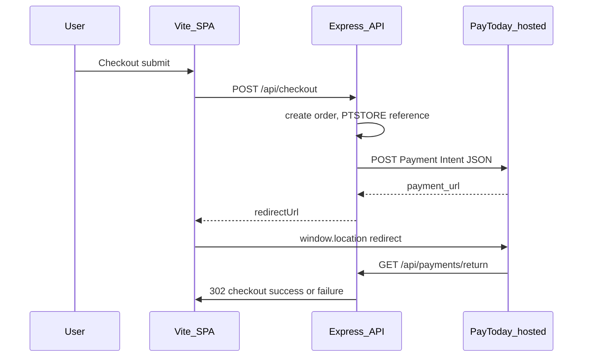

# PayToday Payment Intent (this repo)

Server-side integration: the browser never calls PayToday’s admin API directly. Secrets (`vi`, `business_id`) stay in environment variables only.

## Architecture



Code: [`backend/src/services/paytodayForms.ts`](../backend/src/services/paytodayForms.ts), [`backend/src/routes/api/checkout.ts`](../backend/src/routes/api/checkout.ts), [`backend/src/routes/api/paymentReturn.ts`](../backend/src/routes/api/paymentReturn.ts), webhook [`backend/src/routes/webhooks/paytoday.ts`](../backend/src/routes/webhooks/paytoday.ts).

**Storefront developers:** read [`docs/PAYTODAY_PAYMENT_INTENT_FRONTEND.md`](PAYTODAY_PAYMENT_INTENT_FRONTEND.md) for the SPA pattern (BFF, no `vi`/`business_id` in the browser). It aligns with PayToday’s public “HTML form + JavaScript” guide.

### PayToday JSON field mapping (official Payment Intent)

| PayToday field | Source in this repo |
|----------------|---------------------|
| `vi` | `PAYTODAY_VENDOR_ID` (env, server only) |
| `amount` | Order total as float (`total_cents / 100`) |
| `reference` | `PTSTORE-{orderId}` |
| `business_id` | `PAYTODAY_BUSINESS_ID` (env, server only) |
| `user_email` | Guest `guestEmail` or signed-in user email |
| `return_url` | `{PUBLIC_API_URL}/api/payments/return?reference=…&orderId=…` |
| `invoice_number` | Same as `reference` (optional, for PayToday display) |
| `user_first_name` / `user_last_name` | From `users.full_name` (signed-in) or optional `guestFirstName` / `guestLastName` on checkout |
| `user_phone_number` | Optional `guestPhone` on checkout |

Expected success response: HTTP **201** (or **200**) with `success: true` and `payment_url`; see `resolveOfficialPaymentIntent` in `paytodayForms.ts`.

## Environment (configure before staging)

| Variable | Purpose |
|----------|---------|
| `PAYTODAY_PAYMENT_INTENT_URL` | e.g. `https://admin.today-ww.net/web/customs/vendor/forms/` — enables official intent JSON path |
| `PAYTODAY_VENDOR_ID` | Maps to JSON field `vi` |
| `PAYTODAY_BUSINESS_ID` | Positive integer `business_id` |
| `PUBLIC_API_URL` | Must match the URL PayToday can call for `return_url` (HTTPS in production) |
| `PUBLIC_STORE_URL` | Storefront origin for post-payment redirects |
| `PAYTODAY_WEBHOOK_SECRET` | Verifies `POST /api/webhooks/paytoday` (authoritative when configured) |

Copy from [`backend/.env.example`](../backend/.env.example). Do not commit real `.env`.

## Database migration

Apply migration **007** so `payment_intent_token`-only returns can resolve orders:

```bash
npm run db:migrate
```

File: [`backend/migrations/007_orders_paytoday_intent_token.sql`](../backend/migrations/007_orders_paytoday_intent_token.sql).

## Staging test checklist

Run API + SPA (`npm run dev` or deployed equivalents).

1. **Health:** `GET /api/health` — database `connected` if checkout must hit SQL.
2. **Happy path:** Complete checkout (signed-in home or guest pickup with valid email) → redirect to PayToday → pay (or sandbox) → land on `/checkout/success?orderId=...`.
3. **Failure path:** Cancel or fail payment → `/checkout/failure?orderId=...`.
4. **Idempotency:** Double-click “Pay with PayToday” quickly — same order / redirect behaviour (checkout idempotency key).
5. **Webhook:** Send a signed test payload to `POST /api/webhooks/paytoday` (see smoke tests / PayToday portal) and confirm order state + notifications if SQL is enabled.
6. **Return URL:** Confirm PayToday’s redirect preserves `reference` / `orderId` query params; if not, `payment_intent_token` lookup requires migration 007 applied.

## Do not

- Add `GET /api/payment/config` returning `vi` or `business_id` to the browser.
- Call PayToday Payment Intent from Vite client code (CORS, secret leakage).

---

## Webhook receiver (operations and audit)

Code: [`backend/src/routes/webhooks/paytoday.ts`](../backend/src/routes/webhooks/paytoday.ts). Mount order: registered on `createApp()` **before** `express.json()` with `express.raw({ type: '*/*', limit: '2mb' })` so HMAC is computed over the exact bytes PayToday sent ([`backend/src/app.ts`](../backend/src/app.ts)).

### Endpoints

| Method | Path | Body |
|--------|------|------|
| `POST` | `/api/webhooks/paytoday` | Raw JSON (parsed after verify) |
| `POST` | `/api/payments/webhook` | Same handler (alias for portal configuration flexibility) |

### Signature verification

| Item | Detail |
|------|--------|
| Header | `x-paytoday-signature` or `X-PayToday-Signature` (first non-empty wins in code) |
| Algorithm | `HMAC-SHA256(secret, rawBody)` → **hex** string, compared with `crypto.timingSafeEqual` to the header bytes |
| Secret | `PAYTODAY_WEBHOOK_SECRET` merged via `mergePayTodayRuntime` / integration settings (see `integrationRuntimeConfig`) |
| Production | If the secret is empty, verification **fails** (no accidental open webhooks) |
| Development | Empty secret allows webhooks through **only** when `NODE_ENV !== 'production'` (still discouraged) |

Failure: **401** `{ "error": "Invalid webhook signature" }`. Malformed body: **400** (`Expected raw body` / `Invalid JSON`).

### Idempotency and ordering

1. **Event id:** Derived from payload fields (`eventId`, `id`, `paymentId`, `event_id`, or `reference` + status, else SHA-256 of raw body) — capped for storage.
2. **Deduplication:** When SQL is available, `INSERT` into `dbo.payment_webhook_events` only if `event_id` is new; duplicate → **200** `{ ok: true, duplicate: true }` without re-applying business logic.
3. **No SQL pool:** In-memory `Set` for the process lifetime only (dev / degraded).

Duplicate or out-of-order delivery should therefore be safe: second delivery short-circuits at persistence.

### Resolving the order

Order id resolution (first match wins):

1. JSON `orderId` (string).
2. `reference` starting with `PTSTORE-` → suffix is UUID string.
3. `payment_intent_token` or `paymentIntentToken` → lookup `dbo.orders.paytoday_payment_intent_token` (requires migration **007** if that column is used).

If no order: **200** `{ ok: true, received: true, orderId: null, note: 'order not resolved' }` — acknowledged without mutation.

### Payment outcome interpretation

Handler uses heuristic flags on the parsed object:

- **Paid:** status / `payment_status` in `paid`, `success`, `completed`, `captured`, `succeeded`; or `success === true`; or `eventType` indicating payment success (including `payment.succeeded`).
- **Failed / cancelled:** status in failed/declined/error/rejected or cancelled/void variants.

**Apply logic** (`applyWebhook`):

- **Paid:** `confirmOrderPaid`, `markPaymentWebhookProcessed` when applicable; no-op if order already in a terminal paid-ish state.
- **Failed or cancelled:** If order not already shipped/delivered/paid, attempts `cancelUnshippedOrderAdmin`, then `markPaymentFailedFromWebhook`. If already terminal paid, returns **noop** (no reversal from webhook alone).

### Responses and operations

| HTTP | Meaning |
|------|---------|
| 200 | Event accepted (possibly duplicate, noop, or applied) |
| 401 | Bad or missing signature |
| 400 | Not a buffer body or invalid JSON |
| 500 | Unexpected error after accept path started |

**Replay / testing:** Use a signed payload from the PayToday portal or internal smoke tooling; confirm row in `payment_webhook_events` and order status in `dbo.orders`. See [PAYTODAY_E2E_SMOKE.md](PAYTODAY_E2E_SMOKE.md).

**Observability:** Server logs warnings on unexpected cancel errors; success path returns JSON including `eventId`, `orderId`, and `action` (`paid` | `failed` | `cancelled` | `noop`).
