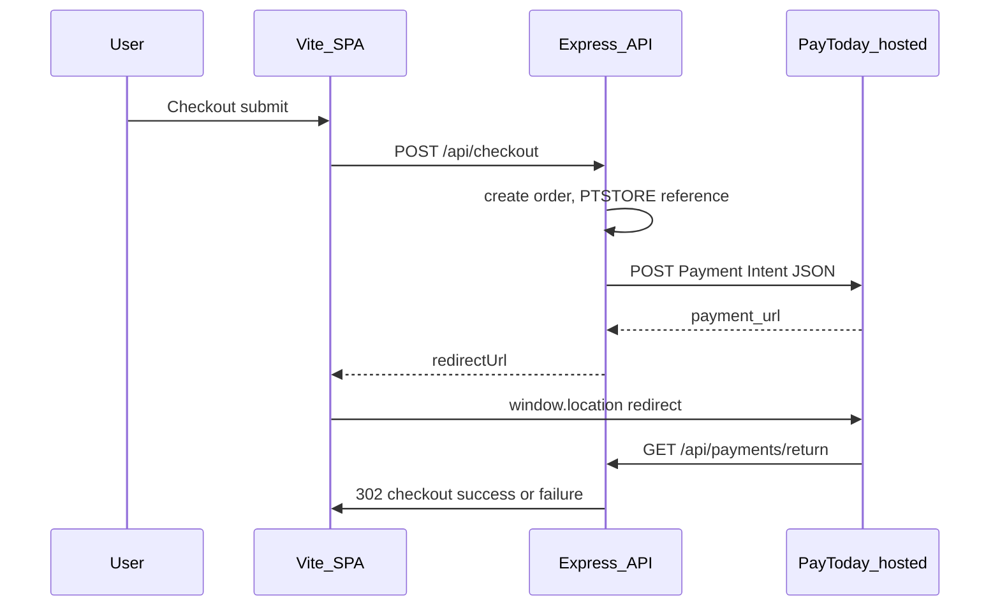

# PayToday Payment Intent (this repo)

Server-side integration: the browser never calls PayToday’s admin API directly. Secrets (`vi`, `business_id`) stay in environment variables only.

## Architecture



Code: [`backend/src/services/paytodayForms.ts`](../backend/src/services/paytodayForms.ts), [`backend/src/routes/api/checkout.ts`](../backend/src/routes/api/checkout.ts), [`backend/src/routes/api/paymentReturn.ts`](../backend/src/routes/api/paymentReturn.ts), webhook [`backend/src/routes/webhooks/paytoday.ts`](../backend/src/routes/webhooks/paytoday.ts).

**Storefront developers:** read [`docs/PAYTODAY_PAYMENT_INTENT_FRONTEND.md`](PAYTODAY_PAYMENT_INTENT_FRONTEND.md) for the SPA pattern (BFF, no `vi`/`business_id` in the browser). It aligns with PayToday’s public “HTML form + JavaScript” guide.

### PayToday JSON field mapping (official Payment Intent)

| PayToday field | Source in this repo |
|----------------|---------------------|
| `vi` | `PAYTODAY_VENDOR_ID` (env, server only) |
| `amount` | Order total as float (`total_cents / 100`) |
| `reference` | `PTSTORE-{orderId}` |
| `business_id` | `PAYTODAY_BUSINESS_ID` (env, server only) |
| `user_email` | Guest `guestEmail` or signed-in user email |
| `return_url` | `{PUBLIC_API_URL}/api/payments/return?reference=…&orderId=…` |
| `invoice_number` | Same as `reference` (optional, for PayToday display) |
| `user_first_name` / `user_last_name` | From `users.full_name` (signed-in) or optional `guestFirstName` / `guestLastName` on checkout |
| `user_phone_number` | Optional `guestPhone` on checkout |

Expected success response: HTTP **201** (or **200**) with `success: true` and `payment_url`; see `resolveOfficialPaymentIntent` in `paytodayForms.ts`.

## Environment (configure before staging)

| Variable | Purpose |
|----------|---------|
| `PAYTODAY_PAYMENT_INTENT_URL` | e.g. `https://admin.today-ww.net/web/customs/vendor/forms/` — enables official intent JSON path |
| `PAYTODAY_VENDOR_ID` | Maps to JSON field `vi` |
| `PAYTODAY_BUSINESS_ID` | Positive integer `business_id` |
| `PUBLIC_API_URL` | Must match the URL PayToday can call for `return_url` (HTTPS in production) |
| `PUBLIC_STORE_URL` | Storefront origin for post-payment redirects |
| `PAYTODAY_WEBHOOK_SECRET` | Verifies `POST /api/webhooks/paytoday` (authoritative when configured) |

Copy from [`.env.example`](../.env.example). Do not commit real `.env`.

## Database migration

Apply migration **007** so `payment_intent_token`-only returns can resolve orders:

```bash
npm run db:migrate
```

File: [`backend/migrations/007_orders_paytoday_intent_token.sql`](../backend/migrations/007_orders_paytoday_intent_token.sql).

## Staging test checklist

Run API + SPA (`npm run dev` or deployed equivalents).

1. **Health:** `GET /api/health` — database `connected` if checkout must hit SQL.
2. **Happy path:** Complete checkout (signed-in home or guest pickup with valid email) → redirect to PayToday → pay (or sandbox) → land on `/checkout/success?orderId=...`.
3. **Failure path:** Cancel or fail payment → `/checkout/failure?orderId=...`.
4. **Idempotency:** Double-click “Pay with PayToday” quickly — same order / redirect behaviour (checkout idempotency key).
5. **Webhook:** Send a signed test payload to `POST /api/webhooks/paytoday` (see smoke tests / PayToday portal) and confirm order state + notifications if SQL is enabled.
6. **Return URL:** Confirm PayToday’s redirect preserves `reference` / `orderId` query params; if not, `payment_intent_token` lookup requires migration 007 applied.

## Do not

- Add `GET /api/payment/config` returning `vi` or `business_id` to the browser.
- Call PayToday Payment Intent from Vite client code (CORS, secret leakage).
