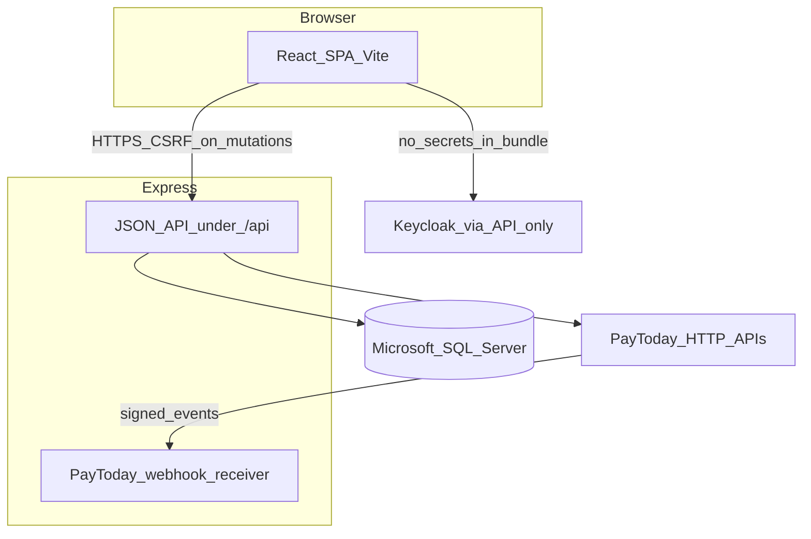
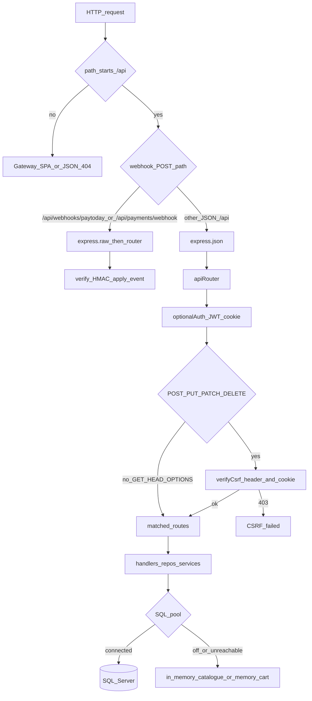
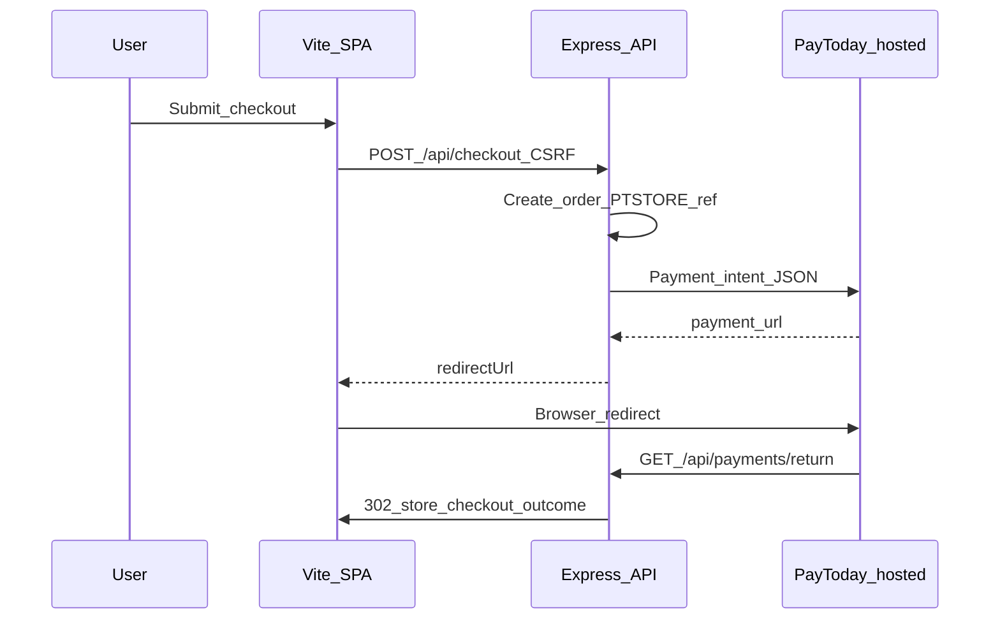
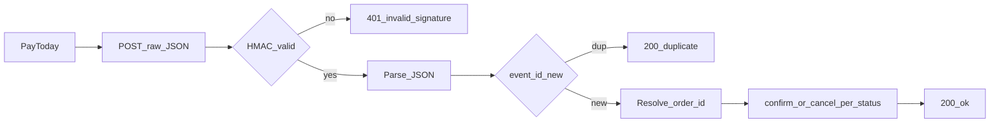
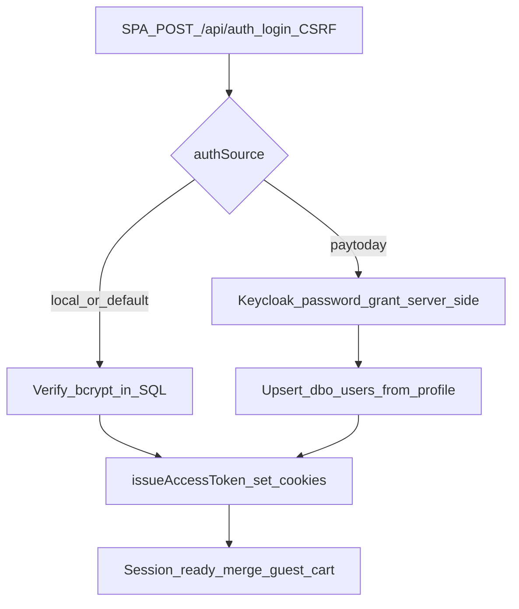
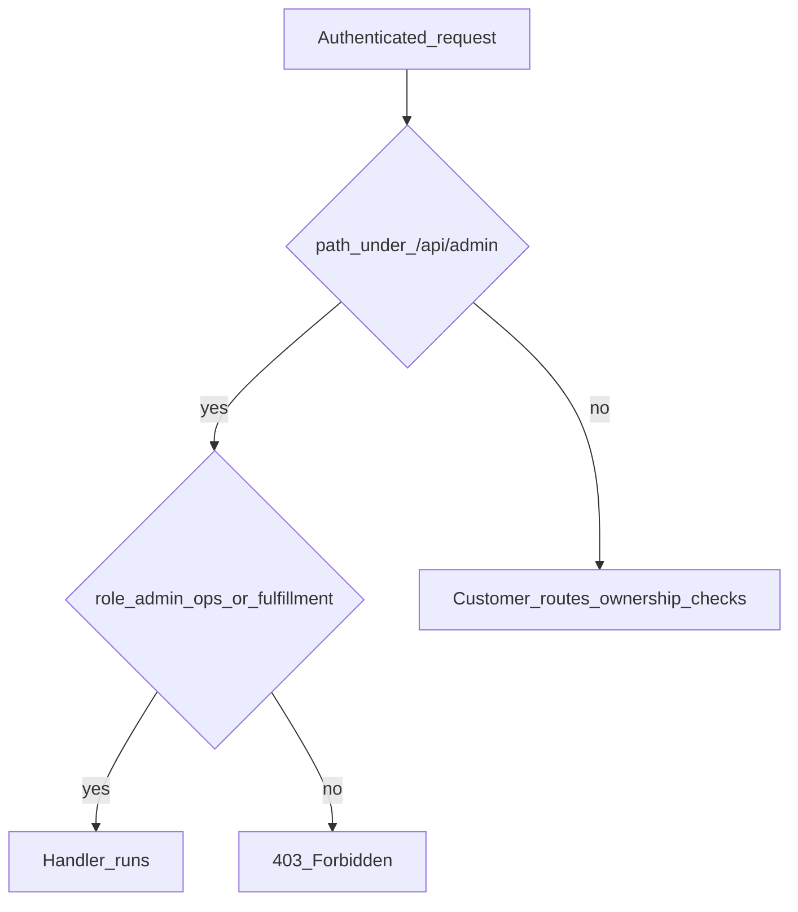

# Project handbook — storefront, wallet, and merchant admin

**Last reviewed:** 2026-04-24  
**Repository role:** Customer storefront, wallet hub, payments flows, classifieds, onboarding, and merchant admin — backed by a TypeScript Express API and Microsoft SQL Server.

This document is the **map of the world**: what the product is, where routes and APIs live, how requests and auth flow through the stack, and where deeper specs live. It does not replace specialised docs (Keycloak, payment intent, deploy).

---

## 1. Executive summary and project identity

### Elevator pitch

A **single-page React application** (Vite) gives shoppers a store, wallet, profile hub, and bill-pay style flows, while **staff** use a separate **merchant admin** area for catalogue, inventory, orders, fulfillment, and deposit boxes. An **Express** API under `/api` holds business rules, talks to **Microsoft SQL Server** for catalogue and orders when configured, and integrates **PayToday** (payment intent + webhooks) and optionally **Keycloak** for PayToday-branded sign-in — all without exposing payment secrets to the browser.

### Core technology stack

| Layer | Technology |
|--------|-------------|
| Customer and admin UI | React 18+, TypeScript, Vite, React Router, MUI |
| HTTP API | Node.js, Express, TypeScript |
| Persistence | Microsoft SQL Server (migrations under `backend/migrations/`); repository-style access — see [ARCHITECTURE_DATA_LAYER.md](ARCHITECTURE_DATA_LAYER.md) and [ADR-001-data-access.md](ADR-001-data-access.md) |
| Identity (optional) | Keycloak (password grant server-side only; SPA never holds realm secrets) |
| Payments | PayToday payment intent (server-side), browser return URL, HMAC webhooks |

### Branding — source of truth

| Asset | Location |
|--------|-----------|
| Customer-facing **name** and wallet label | `frontend/src/theme/branding.ts` — `APP_DISPLAY_NAME`, `APP_WALLET_DISPLAY_NAME`, logo mark segments |
| Logos and favicons | `frontend/public/` (e.g. `brand-logo.svg`, `favicon.svg`) |
| API process name in health JSON | `paytoday-store-api` in [`backend/src/routes/api/index.ts`](../backend/src/routes/api/index.ts) |

**Naming note:** The UI display name is currently **AvoToday** (`APP_DISPLAY_NAME`). The repository and API strings often say **PayToday Store** — treat **branding.ts** as the source for customer-visible copy; align marketing and legal naming in the same place when you rebrand.

### Primary users (personas)

| Persona | Needs from this repo |
|---------|------------------------|
| **Customer** | Browse `/shop`, cart/checkout, orders, wallet, profile, notifications |
| **Merchant admin / ops / fulfillment** | `/admin/*` after sign-in; API roles `admin`, `ops`, `fulfillment` |
| **Product, QA, security, ops** | This handbook + linked checklists and scope docs |

---

## 2. Information architecture (sitemap)

Routes below omit the optional **`/embed`** prefix. In embed mode the **same** route tree exists under `/embed/...`; the index route `/embed` redirects to `/embed/shop` (no duplicate home on `embed` itself). See [EMBED.md](EMBED.md).

### 2.1 Storefront and commerce

| Capability | Route(s) | Notes |
|------------|------------|--------|
| Home | `/` | Store layout entry |
| Intro carousel | `/intro` | |
| Shop / catalogue | `/shop` | Includes `#shop-bill-pay` anchor for bill-pay hub |
| Product detail | `/shop/:slug` | [PRODUCT_PAGE_LAYOUT_SPEC.md](PRODUCT_PAGE_LAYOUT_SPEC.md) |
| Cart | `/cart` | Server-backed cart; see §3 |
| Checkout | `/checkout` | PayToday or demo wallet per API |
| Checkout outcomes | `/checkout/success`, `/checkout/failure`, `/checkout/complete` | |
| Orders | `/orders`, `/orders/:orderId`, `/orders/:orderId/return` | |
| Track order | `/orders/track` | |
| Account | `/account` | Legacy account surface |

**`/payments`:** `GET /payments` **redirects** to `/shop#shop-bill-pay` (bill-pay lives on the shop page). Category pages remain at `/payments/:categoryId`; legacy `/payments/category/:id` redirects to `/payments/:id`.

### 2.2 Onboarding and store auth

| Capability | Route(s) |
|--------------|----------|
| Onboarding loading | `/onboarding/loading` |
| Sign-in / register | `/onboarding/login` |
| Forgot / reset password | `/forgot-password`, `/reset-password` |
| Complete profile, permissions | `/onboarding/complete-profile`, `/onboarding/permissions` |
| Add card / bank (demo-style) | `/onboarding/add-card`, `/onboarding/add-bank` |

Deep dive: [KEYCLOAK_AUTH_MODEL.md](KEYCLOAK_AUTH_MODEL.md), [KEYCLOAK_API.md](KEYCLOAK_API.md), [AUTHENTICATION_DEEP_DIVE (1).md](AUTHENTICATION_DEEP_DIVE%20(1).md).

### 2.3 Services and bill pay

| Capability | Route(s) | Notes |
|------------|------------|--------|
| Services hub | `/services` | |
| Insurance | `/services/insurance` | |
| Hub demo | `/services/:slug`, `/payments/:categoryId/pay/:itemId` | Simulated gateway messaging |

### 2.4 Wallet

| Capability | Route(s) | Notes |
|------------|------------|--------|
| Wallet home | `/wallet` | |
| Rewards | `/wallet/rewards` | |
| PayToday hub | `/wallet/paytoday`, `/wallet/paytoday/:action` | `:action` may be placeholder |
| Cards, bank, transactions | `/wallet/cards`, `/wallet/cards/:cardId`, `/wallet/bank`, `/wallet/transactions`, `/wallet/transactions/:txId` | |
| Vouchers | `/wallet/vouchers` | |
| Scan | `/wallet/scan`, `/wallet/scan/pay-code`, `receive-qr`, `my-qr` | Legacy `/scan/*` redirects here |

**UI only (placeholders — copy explains future connectivity):**

| Route |
|--------|
| `/wallet/request-payment` |
| `/wallet/split-bill` |
| `/wallet/cashout` |

### 2.5 Profile, notifications, classifieds

| Capability | Route(s) |
|--------------|----------|
| Profile hub | `/profile` |
| Personal, addresses, email | `/profile/personal`, `/profile/addresses`, `/profile/confirm-email` |
| Support, FAQ, feedback | `/profile/support`, `/profile/faq`, `/profile/feedback`, `/profile/feedback/sent` |
| Settings, legal, delete | `/profile/settings`, `/profile/legal`, `/profile/delete-account` |
| Notifications | `/notifications`, `/notifications/:id` |
| Classifieds | `/classifieds`, `/classifieds/post`, `/classifieds/:id` |

### 2.6 Merchant admin

| Capability | Route | Notes |
|------------|--------|--------|
| Admin login | `/admin/login` | Same `/api/auth/login` as store; must return staff role |
| Dashboard | `/admin` | |
| Products / categories | `/admin/products`, `/admin/categories` | |
| Orders / returns | `/admin/orders`, `/admin/returns` | |
| Inventory | `/admin/inventory` | |
| Fulfillment | `/admin/fulfillment` | |
| Deposit boxes | `/admin/deposit-boxes` | |

SPA guard: **`RequireAdminStaff`**. API: **`/api/admin/*`** with `requireAuth` + `requireRole` on each router.

### 2.7 Commerce rules

[BUSINESS_RULES.md](BUSINESS_RULES.md), [SCOPE_ALIGNMENT.md](SCOPE_ALIGNMENT.md).

---

## 3. Technical architecture and data flow

### 3.1 System context

After sign-in, the API issues **HttpOnly JWT cookies** (`pt_session` / `pt_refresh`); see §5.

- **Frontend:** `frontend/` (Vite). Dev proxy sends `/api` to the API port.
- **Backend:** `backend/` → compiled `dist/` for Node.
- **Webhooks:** Mounted on `createApp()` **before** `express.json()` so the HMAC is computed over the **raw** body ([`backend/src/app.ts`](../backend/src/app.ts)).

### 3.2 HTTP API request path (Express stack)

**CSRF:** `GET /api/csrf` returns `{ csrfToken }` and sets cookie `pt_csrf`. Mutating requests must send header **`x-csrf-token`** matching that cookie ([`backend/src/middleware/csrf.ts`](../backend/src/middleware/csrf.ts)).

**Before `verifyCsrf` on `apiRouter`:** `GET /api/health`, `GET /api/csrf`, public **GET** storefront paths (via `storefrontPublicRouter`), and **GET** PayToday browser return under `/api/payments` ([`backend/src/routes/api/index.ts`](../backend/src/routes/api/index.ts)).

### 3.3 Checkout happy path (high level)

Full sequence and field mapping: [PAYTODAY_PAYMENT_INTENT.md](PAYTODAY_PAYMENT_INTENT.md).

### 3.4 Data access

No ORM on the documented path: **parameterised SQL** via `mssql` pools and repos. See [ARCHITECTURE_DATA_LAYER.md](ARCHITECTURE_DATA_LAYER.md), [ADR-001-data-access.md](ADR-001-data-access.md).

### 3.5 Frontend state — cart

The cart is **authoritative on the server** (`/api/cart`), keyed by session cookie / user merge logic in [`backend/src/services/cartService.ts`](../backend/src/services/cartService.ts). The SPA refreshes counts by calling the API and listening for the custom event **`pt-cart-updated`** after mutations (see [`frontend/src/lib/cartClient.ts`](../frontend/src/lib/cartClient.ts)). There is no separate global client-side cart store requirement.

### 3.6 Background work

When `SQL_CONNECTION_STRING` is set and the pool connects, [`backend/src/index.ts`](../backend/src/index.ts) starts the **notification worker** (interval drain of `notification_outbox`).

---

## 4. API surface and webhooks

### 4.1 REST prefixes under `/api`

Curated from [`backend/src/routes/api/index.ts`](../backend/src/routes/api/index.ts):

| Prefix | Purpose |
|--------|---------|
| `GET /api/health` | Liveness; SQL connectivity |
| `GET /api/csrf` | CSRF double-submit bootstrap |
| `GET /api/storefront-config`, `/api/categories`, `/api/hub/*`, `/api/promotions`, … | Public merchandising (no CSRF on GET) |
| `GET /api/payments/*` | PayToday **browser return** (redirect; no CSRF) |
| `/api/auth` | Register, login, refresh, logout, password flows, `/me` |
| `/api/notifications`, `/api/wallet`, `/api/hub` | Authenticated or mixed per route |
| `/api/products`, `/api/cart`, `/api/checkout` | Catalogue, cart, checkout |
| `/api/addresses`, `/api/orders`, `/api/returns` | Customer data |
| `/api/deposit`, `/api/fulfillment` | Pickup / fulfillment (role-gated) |
| `/api/admin/*` | Admin products, categories, orders, returns, inventory, overview, deposit |

Unknown paths return **404 JSON** (never the SPA HTML from the API router).

### 4.2 Public vs authenticated (summary)

| Class | Examples | Auth |
|-------|------------|------|
| Public read | `/api/health`, storefront GETs | None |
| Public mutating without session | — | Rare; most POSTs need CSRF + business rules |
| CSRF-protected mutating | `/api/cart`, `/api/checkout`, `/api/auth/login` | CSRF; cart allows guest via cookie |
| Cookie JWT required | `/api/auth/me`, `/api/orders/mine`, most `/api/admin/*` | `requireAuth` + often `requireRole` |

Per-route detail lives on handlers in `backend/src/routes/api/`.

### 4.3 PayToday webhooks (ingress)

PayToday posts **JSON** to **`POST /api/webhooks/paytoday`** or the alias **`POST /api/payments/webhook`**. The body is read as **raw bytes**, verified with **HMAC-SHA256** using `PAYTODAY_WEBHOOK_SECRET` (merged with `integration_settings` unless `INTEGRATION_USE_ENV_ONLY`), header **`x-paytoday-signature`** (case-insensitive get). On success the handler resolves the order, applies idempotent persistence, and may confirm payment or cancel unshipped orders on failure-type payloads.

Operational and audit detail: [PAYTODAY_PAYMENT_INTENT.md — Webhook receiver](PAYTODAY_PAYMENT_INTENT.md#webhook-receiver-operations-and-audit).

**Return URL vs webhook:** The browser **GET** return is best-effort UX; the **webhook** (when configured) is the robust path for marking an order paid and side effects. See payment docs.

---

## 5. Authentication and security

### 5.1 Session model

- **Access token:** JWT in HttpOnly cookie **`pt_session`** (override: `AUTH_COOKIE_NAME`).
- **Refresh token:** separate HttpOnly cookie **`pt_refresh`**; `POST /api/auth/refresh` rotates access.
- **`optionalAuth`** on all `apiRouter` traffic parses JWT when present and attaches `req.user`.

### 5.2 Customer sign-in (conceptual)

Keycloak is **only** used from the API when `KEYCLOAK_*` (or SQL integration overrides) are set. The SPA calls **`GET /api/auth/keycloak/status`** to know if `authSource: "paytoday"` is allowed.

### 5.3 Admin sign-in

**`/admin/login`** uses the **same** `POST /api/auth/login` contract. The SPA then checks **`GET /api/auth/me`** for role in **`admin`**, **`ops`**, or **`fulfillment`** before entering `/admin/*`.

### 5.4 Role-based access (API)

Examples: `adminProductsRouter` uses `requireRole('admin', 'ops')`; `fulfillmentRouter` uses `requireRole('admin', 'ops', 'fulfillment')`; `GET /api/admin/ping` requires any of those three roles.

### 5.5 Security measures (pointers)

- **CSRF:** double-submit cookie + header on mutating `/api` routes after public exceptions ([`backend/src/middleware/csrf.ts`](../backend/src/middleware/csrf.ts)).
- **Input validation:** [INPUT_VALIDATION.md](INPUT_VALIDATION.md).
- **Review checklist:** [SECURITY_CHECKLIST.md](SECURITY_CHECKLIST.md).
- **Keycloak model:** [KEYCLOAK_AUTH_MODEL.md](KEYCLOAK_AUTH_MODEL.md).

---

## 6. Operations and deployment (runbook)

- **Build, env vars, production serving:** [DEPLOY.md](DEPLOY.md).
- **Host-specific ops:** [KRUGERNET_RUNBOOK.md](KRUGERNET_RUNBOOK.md) (if applicable).
- **Reset / demo database:** [RESET_CATALOG_AND_USERS.md](RESET_CATALOG_AND_USERS.md), Docker notes in [`.env.example`](../.env.example).

### Environment variables (categories)

| Category | Examples (see `.env.example` for full list) |
|----------|-----------------------------------------------|
| Process | `PORT`, `NODE_ENV`, `CORS_ORIGINS` |
| Database | `SQL_CONNECTION_STRING`, optional SQL auth fragments |
| Session | `JWT_SECRET`, `AUTH_COOKIE_NAME`, `REFRESH_COOKIE_NAME`, `COOKIE_SAME_SITE` |
| Public URLs | `PUBLIC_STORE_URL`, `PUBLIC_API_URL` |
| PayToday | `PAYTODAY_*`, `PAYTODAY_WEBHOOK_SECRET` |
| Keycloak | `KEYCLOAK_BASE_URL`, `KEYCLOAK_REALM`, `KEYCLOAK_CLIENT_ID`, `KEYCLOAK_CLIENT_SECRET` |
| Notify / email | `NOTIFY_SERVICE_*`, SMTP variables |
| Integration source | `INTEGRATION_USE_ENV_ONLY` — when true, skip `dbo.integration_settings` for PayToday/Keycloak/notify |

---

## 7. Scope and roadmap honesty

Not every UI label implies a production integration today.

- **[SCOPE_ALIGNMENT.md](SCOPE_ALIGNMENT.md)** — deliberate differences (e.g. stock reservation timing, pickup codes).
- **[SCOPE_ACCEPTANCE_TRACEABILITY.md](SCOPE_ACCEPTANCE_TRACEABILITY.md)** — acceptance vs phase 2.

Wallet placeholders are listed in **§2.4**.

---

## 8. Document map

Paths relative to `docs/`.

| Document | One-line purpose | Primary audience |
|----------|------------------|-------------------|
| [PROJECT_HANDBOOK.md](PROJECT_HANDBOOK.md) | This overview — identity, IA, architecture, API, auth, ops, map | All |
| [DEPLOY.md](DEPLOY.md) | Build, env, production | Ops, engineering |
| [EMBED.md](EMBED.md) | `/embed` prefix | Engineering, partners |
| [BUSINESS_RULES.md](BUSINESS_RULES.md) | Domain rules | Product, engineering |
| [SCOPE_ALIGNMENT.md](SCOPE_ALIGNMENT.md) | Scope vs repo | Product |
| [SCOPE_ACCEPTANCE_TRACEABILITY.md](SCOPE_ACCEPTANCE_TRACEABILITY.md) | Acceptance mapping | QA, product |
| [ARCHITECTURE_DATA_LAYER.md](ARCHITECTURE_DATA_LAYER.md) | Persistence patterns | Engineering |
| [ADR-001-data-access.md](ADR-001-data-access.md) | Data access ADR | Engineering |
| [KEYCLOAK_AUTH_MODEL.md](KEYCLOAK_AUTH_MODEL.md) | OIDC vs ROPC, sessions | Engineering, security |
| [KEYCLOAK_API.md](KEYCLOAK_API.md) | Keycloak HTTP index | Engineering |
| [AUTHENTICATION_DEEP_DIVE (1).md](AUTHENTICATION_DEEP_DIVE%20(1).md) | Long-form auth | Engineering |
| [PAYTODAY_PAYMENT_INTENT.md](PAYTODAY_PAYMENT_INTENT.md) | Intent + webhook receiver | Engineering |
| [PAYTODAY_PAYMENT_INTENT_FRONTEND.md](PAYTODAY_PAYMENT_INTENT_FRONTEND.md) | SPA checkout pattern | Engineering |
| [INTEGRATION_CHECKLIST.md](INTEGRATION_CHECKLIST.md) | Third-party checklist | Engineering, ops |
| [INPUT_VALIDATION.md](INPUT_VALIDATION.md) | Validation policy | Engineering |
| [SECURITY_CHECKLIST.md](SECURITY_CHECKLIST.md) | Security review | Security |
| [PRODUCT_PAGE_LAYOUT_SPEC.md](PRODUCT_PAGE_LAYOUT_SPEC.md) | PDP layout | Design, frontend |
| [PAYTODAY_E2E_SMOKE.md](PAYTODAY_E2E_SMOKE.md) | Payment smoke | QA |
| [UAT_CHECKLIST.md](UAT_CHECKLIST.md) | UAT | QA, product |
| [RESET_CATALOG_AND_USERS.md](RESET_CATALOG_AND_USERS.md) | Demo reset | Ops |
| [ER_BUSINESSES.md](ER_BUSINESSES.md) | Businesses ER notes | Engineering, data |
| [KRUGERNET_RUNBOOK.md](KRUGERNET_RUNBOOK.md) | Host runbook | Ops |
| [FRONTEND_TOOLING.md](FRONTEND_TOOLING.md) | Vite / ESLint | Frontend |
| [README.md](README.md) | Short index into this folder | All |
| [README.md](../README.md) | Repo root quick start | All |

---

*When you add a major feature or route, update **§2** and a row in **§8** in the same pull request.*
